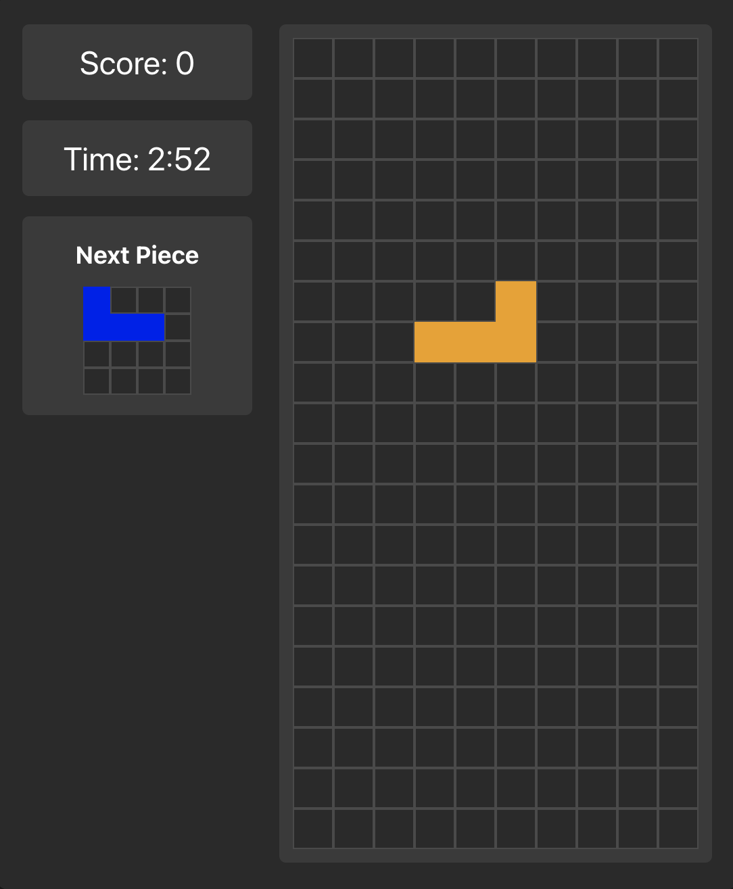

# Blocks - React Tetris Game

A modern, responsive Tetris game built with React and Vite. Features classic Tetris gameplay with both desktop and mobile controls, scoring system, and a 3-minute time challenge.



## 🎮 Features

- **Classic Tetris Gameplay**: All 7 traditional Tetris pieces (I, J, L, O, S, T, Z)
- **Responsive Design**: Works seamlessly on desktop and mobile devices
- **Multiple Control Methods**:
  - Keyboard controls (arrow keys)
  - Touch/swipe gestures for mobile
  - On-screen control buttons
- **Game Features**:
  - Real-time scoring system
  - 3-minute time challenge
  - Next piece preview
  - Line clearing mechanics
  - Game over detection
- **Mobile Optimized**: Touch-friendly interface with swipe controls

## 🚀 Getting Started

### Prerequisites

- Node.js (version 14 or higher)
- npm or yarn

### Installation

1. Clone the repository:
```bash
git clone <repository-url>
cd blocks
```

2. Install dependencies:
```bash
npm install
```

3. Start the development server:
```bash
npm run dev
```

4. Open your browser and navigate to `http://localhost:5173`

## 🎯 How to Play

### Desktop Controls
- **Left Arrow**: Move piece left
- **Right Arrow**: Move piece right
- **Down Arrow**: Move piece down faster
- **Up Arrow**: Rotate piece

### Mobile Controls
- **Swipe Left/Right**: Move piece horizontally
- **Swipe Down**: Move piece down faster
- **Swipe Up**: Rotate piece
- **Control Buttons**: Use the on-screen buttons for precise control

### Game Rules
- Complete horizontal lines to clear them and earn points
- Game ends when pieces reach the top of the board
- You have 3 minutes to achieve the highest score possible
- Each cleared line awards 100 points

## 🛠️ Built With

- **React 19** - Frontend framework
- **Vite** - Build tool and development server
- **CSS3** - Styling and animations
- **Capacitor** - Mobile app deployment (Android support included)

## 📱 Mobile App

This project includes Android app support through Capacitor:

```bash
# Build for Android
npm run build
npx cap add android
npx cap sync android
npx cap open android
```

## 🏗️ Project Structure

```
src/
├── components/
│   └── TetrisGame.jsx    # Main game component
├── styles/
│   └── TetrisGame.css    # Game styling
├── App.jsx               # Root component
└── main.jsx             # Entry point
```

## 🎨 Customization

The game can be easily customized by modifying:

- **Colors**: Update the `COLORS` object in `TetrisGame.jsx`
- **Game Duration**: Change `GAME_DURATION` constant
- **Piece Shapes**: Modify the `TETROMINOES` object
- **Styling**: Edit `TetrisGame.css` for visual changes

## 📦 Available Scripts

- `npm run dev` - Start development server
- `npm run build` - Build for production
- `npm run preview` - Preview production build
- `npm run lint` - Run ESLint

## 🤝 Contributing

1. Fork the repository
2. Create a feature branch (`git checkout -b feature/amazing-feature`)
3. Commit your changes (`git commit -m 'Add amazing feature'`)
4. Push to the branch (`git push origin feature/amazing-feature`)
5. Open a Pull Request

## 📄 License

This project is licensed under the [Creative Commons Attribution-NonCommercial-ShareAlike 4.0 International License](LICENSE).

## 🎉 Acknowledgments

- Classic Tetris game mechanics
- React community for excellent documentation
- Vite team for the amazing build tool

---

**Enjoy playing Blocks!** 🎮✨
